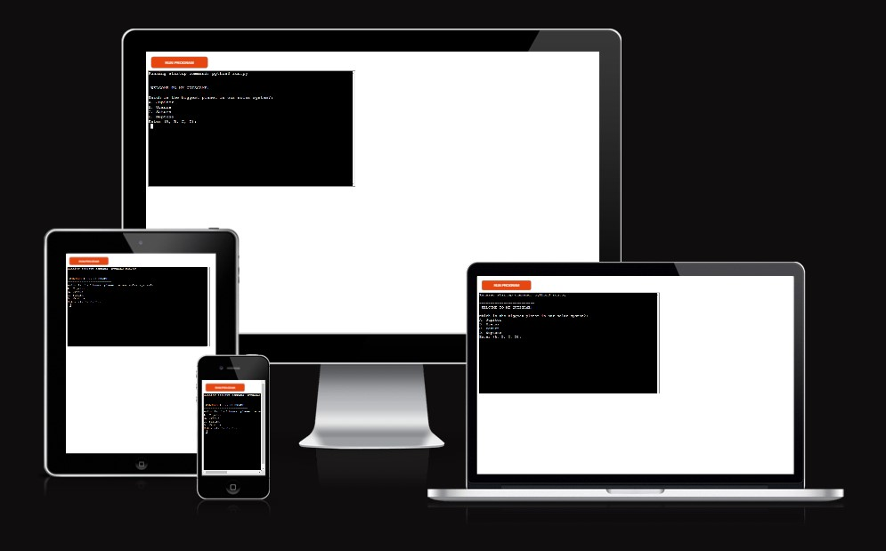
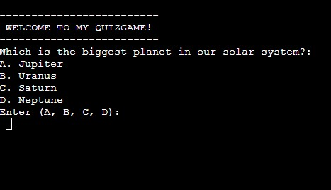
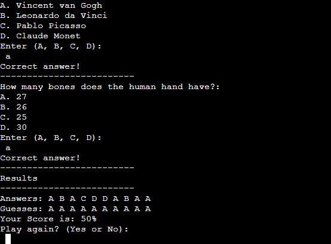

## Quizgame

Quizgame is a terminal based python game where the player have to answer ten specific questions. Each questions have four options but only one is correct. At the end of the game the player will see the score in percentage, the correct answers and aksed to replay the game.

## How to play

Quizgame is a game that asks questions about movies, books, astronomy, animals and much more. There are ten specific questions where the player will have to pick one answer that is correct. The other three options are wrong and the game will print wrong answer if the player choose wrong answer.

The player can choose to replay the game after answering ten questions and try to get better score.

This game is for entertainment purpose and to see if the player have good memory and know random facts.

## Features

This game has two features. One where the player will choose one out of four options for every option that appears. The second feature is where the result will appear, the correct answers and ask the player if he/she want's to play again.

### Existing features

- __The Game Area__

This is where the player will have to choose one out of four options.

- __The Result Area__

This is where the correct answer and player guesses are displayed. The score is displayed in percentage and the player is asked to play again. The player will have to type Yes or No.

### Features left to implement

- One feature that would make the game more difficult and fun would be to add more questions. But everytime the game starts, the game only choose ten random questions. Next time the game starts it chooses ten new questions so that everytime there is new questions to choose from.

- Feature that gives the player the option to show or hide the correct answers.

## Data model

I decided to use functions and dictionary for this project. The game has four functions that let the player start the game, see the available options, choose one asnwer, check the answer and replay the game. The dictionary holds all the options the player can choose from and the questions that are available.

Function
- New game
- Check answer
- Check score
- Replay game

Dictionary
- Options
- Questions

## Testing

I have manually tested this project by doing:

- Passed the code through a PEP8 linter and confirmed there are no significant errors.
- Try different options while playing the game to see if the score is correct.
- Finished the game several times to see if the score is correct and the option to replay appears.

## Bugs

### Solved bugs

- For a while I couldn't start the game properly. I fixed it by making changes in the new_game code.
- When installing dependencies in requirements.txt IDE Codeanywhere installed several dependencies that wasn't necessary and made the deployment to Heroku impossible. I solved this by removing the unecessary ones and kept just the ones that are shown in the CI python module.

### Remaining bugs

- There is no remaining bugs.

### Validator testing

- PEP8
    - No significant errors were returned from the [CI Python Linter](https://pep8ci.herokuapp.com/)

## Deployment

This project was deployed using the Code Institute mock terminal for Heroku.
- Steps for deployment
    - Fork or clone this repository
    - Create a new Heroku app
    - Set the buildbacks to Python and Node35 in that order
    - Link the Heroku app to the repository
    - Click on Deploy

## Credits

The code that I've used in this project is my own. Code that I've learned from Code Institute Python modules, loop tutorial that I found online and from Youtube.

- Code Institute for the basic python knowledge and how to deploy project to Heroku
- [Python Loop](https://www.freecodecamp.org/news/python-while-loop-tutorial/)
- [Bro Code](https://www.youtube.com/watch?v=yriw5Zh406s&t=199s&ab_channel=BroCode)

### Content

- The main game area, function and dictionary comes from [Bro Code](https://www.youtube.com/watch?v=yriw5Zh406s&t=199s&ab_channel=BroCode)

## Media

- There is no media in this project.